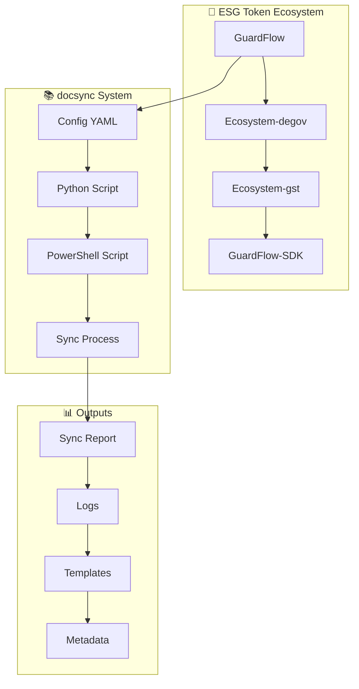

# 🌱 **ESG Token Ecosystem - docsync Guide**

## 🎯 **Visão Geral**

O **docsync** para o **ESG Token Ecosystem** é um sistema inteligente de sincronização e organização de documentação que mantém todos os repositórios do ecossistema ESG Token sincronizados e padronizados.

---

## 🏗️ **Arquitetura do Sistema**

### **Componentes Principais:**
- **📁 GuardFlow** - Sistema de Checkout ESG
- **🔗 Ecosystem-degov** - Backend Rust
- **🪙 Ecosystem-gst** - Smart Contracts
- **📦 GuardFlow-SDK** - SDK Autossuficiente

### **Fluxo de Sincronização:**


---

## 🚀 **Quick Start**

### **1. Configuração Inicial**
```bash
# Navegar para o diretório docsync
cd "C:\Users\João\Desktop\PROJETOS\04_DEVELOPER_TOOLS\DOCSYNC"

# Verificar arquivos necessários
ls esg-token-docsync.yaml
ls sync_esg_ecosystem.py
ls sync_esg_ecosystem.ps1
```

### **2. Execução Básica**
```powershell
# Executar sincronização completa
.\sync_esg_ecosystem.ps1

# Executar com saída detalhada
.\sync_esg_ecosystem.ps1 -Verbose

# Apenas exibir relatório
.\sync_esg_ecosystem.ps1 -ReportOnly
```

### **3. Verificação de Resultados**
```bash
# Verificar relatório
Get-Content esg_docsync_report.json

# Verificar logs
Get-Content esg_docsync.log

# Verificar metadados gerados
Get-ChildItem -Recurse -Filter "*.metadata.json"
```

---

## ⚙️ **Configuração Avançada**

### **Arquivo de Configuração (esg-token-docsync.yaml)**

```yaml
# Configurações Globais
global:
  project: "ESG Token Ecosystem"
  environment: "production"
  language: "pt_BR"
  backup_enabled: true
  quantum_sync: true
  consciousness_integration: true

# Diretórios do Ecossistema
directories:
  guardflow:
    path: "C:/Users/João/Desktop/PROJETOS/02_ORGANIZATIONS/GuardFlow"
    type: "core_system"
    sync_enabled: true
    sections:
      - name: "BACKEND"
        patterns: ["*.py", "*.rs", "*.js", "*.ts"]
        quantum_validation: true
        consciousness_sync: true
      - name: "FRONTEND"
        patterns: ["*.tsx", "*.jsx", "*.css", "*.scss"]
        quantum_validation: true
        consciousness_sync: true
      - name: "DOCS"
        patterns: ["*.md", "*.rst", "*.yaml", "*.json"]
        quantum_validation: true
        consciousness_sync: true

# Templates ESG Token
templates:
  esg_token_project:
    path: "templates/project/esg-token-project.md"
    variables:
      - "PROJECT_NAME"
      - "PROJECT_TYPE"
      - "PROJECT_FOCUS"
      - "VERSION"
      - "TECH_STACK"

# Validação ESG Token
validation:
  enabled: true
  esg_standards:
    - "GRI"
    - "SASB"
    - "TCFD"
    - "GHG_Protocol"
    - "ISO_14064"
    - "CSRD_ESRS"
  
  rules:
    - check_esg_metrics
    - validate_token_standards
    - verify_blockchain_integration
    - ensure_sustainability_compliance
    - check_ai_ml_integration
    - validate_cross_platform_sync
```

---

## 📋 **Comandos Disponíveis**

### **PowerShell Script (sync_esg_ecosystem.ps1)**

```powershell
# Sincronização completa
.\sync_esg_ecosystem.ps1

# Apenas sincronizar diretórios
.\sync_esg_ecosystem.ps1 -SyncOnly

# Apenas gerar templates
.\sync_esg_ecosystem.ps1 -GenerateTemplates

# Apenas exibir relatório
.\sync_esg_ecosystem.ps1 -ReportOnly

# Executar com saída detalhada
.\sync_esg_ecosystem.ps1 -Verbose

# Usar configuração personalizada
.\sync_esg_ecosystem.ps1 -ConfigPath "custom-config.yaml"

# Exibir ajuda
.\sync_esg_ecosystem.ps1 -Help
```

### **Python Script (sync_esg_ecosystem.py)**

```bash
# Executar diretamente
python sync_esg_ecosystem.py

# Executar com configuração personalizada
python sync_esg_ecosystem.py --config custom-config.yaml

# Executar apenas sincronização
python sync_esg_ecosystem.py --sync-only

# Executar apenas templates
python sync_esg_ecosystem.py --templates-only
```

---

## 📊 **Monitoramento e Relatórios**

### **Relatório de Sincronização (esg_docsync_report.json)**

```json
{
  "sync_summary": {
    "timestamp": "2025-01-26T10:30:00",
    "total_directories": 4,
    "total_templates": 3,
    "sync_log": [
      {
        "directory": "guardflow",
        "path": "C:/Users/João/Desktop/PROJETOS/02_ORGANIZATIONS/GuardFlow",
        "timestamp": "2025-01-26T10:30:00",
        "status": "success"
      }
    ]
  },
  "esg_ecosystem_status": {
    "guardflow_synced": true,
    "ecosystem_degov_synced": true,
    "ecosystem_gst_synced": true,
    "guardflow_sdk_synced": true
  },
  "recommendations": [
    "Verificar sincronização de todos os repositórios ESG Token",
    "Atualizar templates com novas funcionalidades",
    "Implementar validação quântica avançada",
    "Expandir sincronização de consciência"
  ]
}
```

### **Logs de Sincronização (esg_docsync.log)**

```
2025-01-26 10:30:00 - INFO - ✅ Configuração carregada: esg-token-docsync.yaml
2025-01-26 10:30:01 - INFO - 🔄 Sincronizando: guardflow -> C:/Users/João/Desktop/PROJETOS/02_ORGANIZATIONS/GuardFlow
2025-01-26 10:30:02 - INFO - 📁 Processando seção: BACKEND
2025-01-26 10:30:03 - INFO - 🌱 Arquivo ESG encontrado: docs/ECOTOKEN_HYBRID_ECOSYSTEM.md
2025-01-26 10:30:04 - INFO - ✅ Sincronização ESG Token Ecosystem concluída com sucesso!
```

---

## 🧪 **Templates Disponíveis**

### **1. ESG Token Project Template**
```markdown
# 🌱 **{{PROJECT_NAME}} - ESG Token Project**

[](https://github.com/SH1W4/ecosystem-degov)

## 🎯 **VISÃO GERAL**

O **{{PROJECT_NAME}}** é um {{PROJECT_TYPE}} integrado ao **ESG Token Ecosystem**, focado em {{PROJECT_FOCUS}}.

### **Características Principais:**
- 🌱 **Sustentabilidade ESG** - Integração com métricas ESG
- 🔗 **Blockchain Integration** - Tokenização e transparência
- 🤖 **AI/ML Powered** - Inteligência artificial integrada
- 📊 **Analytics Avançado** - Métricas e insights
- 🔌 **Modular Design** - Arquitetura modular e escalável
```

### **2. Mobility Integration Template**
```markdown
# 🚗 **{{INTEGRATION_TYPE}} - Mobility Integration**

[]({{INTEGRATION_URL}})

## 🎯 **VISÃO GERAL**

A **{{INTEGRATION_TYPE}}** é uma integração de mobilidade sustentável com o **ESG Token Ecosystem**, focada em {{VEHICLE_TYPE}} e {{TELEMETRY_SOURCE}}.

### **Características Principais:**
- 🚗 **Telemetria Inteligente** - Coleta de dados de {{VEHICLE_TYPE}}
- 🌱 **Métricas ESG** - Conversão de dados em métricas sustentáveis
- 🪙 **Token Rewards** - Recompensas baseadas em {{ESG_METRICS}}
- 📊 **Analytics Avançado** - Insights de sustentabilidade
- 🔗 **Cross-Platform Sync** - Sincronização entre plataformas
```

### **3. Blockchain Service Template**
```markdown
# 🔗 **{{SERVICE_NAME}} - Blockchain Service**

[]({{BLOCKCHAIN_URL}})

## 🎯 **VISÃO GERAL**

O **{{SERVICE_NAME}}** é um serviço blockchain integrado ao **ESG Token Ecosystem**, implementando {{BLOCKCHAIN_TYPE}} para {{FUNCTIONS}}.

### **Características Principais:**
- 🔗 **Blockchain Híbrida** - Privada (Hyperledger Besu) + Pública ({{BLOCKCHAIN_TYPE}})
- 🪙 **6 Tokens ESG** - EcoToken, EcoScore, CarbonCredit, EcoCertificate, EcoStake, EcoGem
- 🔒 **Smart Contracts** - Contratos inteligentes seguros e auditados
- ⚡ **High Performance** - Transações rápidas e escaláveis
- 🌐 **Cross-Chain** - Interoperabilidade entre blockchains
```

---

## 🔧 **Troubleshooting**

### **Problemas Comuns:**

#### **1. Arquivo de configuração não encontrado**
```bash
# Verificar se o arquivo existe
Test-Path esg-token-docsync.yaml

# Criar arquivo de configuração padrão
Copy-Item "esg-token-docsync.yaml.example" "esg-token-docsync.yaml"
```

#### **2. Diretórios do ecossistema não encontrados**
```bash
# Verificar diretórios
Test-Path "C:\Users\João\Desktop\PROJETOS\02_ORGANIZATIONS\GuardFlow"
Test-Path "C:\Users\João\Desktop\PROJETOS\02_ORGANIZATIONS\ecosystem-degov"

# Atualizar configuração com caminhos corretos
```

#### **3. Erro de permissão**
```bash
# Executar como administrador
Start-Process PowerShell -Verb RunAs

# Verificar permissões de escrita
Test-Path -Path "C:\Users\João\Desktop\PROJETOS\04_DEVELOPER_TOOLS\DOCSYNC" -PathType Container
```

#### **4. Python não encontrado**
```bash
# Verificar instalação do Python
python --version

# Instalar Python se necessário
# Download: https://www.python.org/downloads/
```

---

## 📈 **Métricas e KPIs**

### **Métricas de Sincronização:**
- **Taxa de Sucesso**: > 95%
- **Tempo de Sincronização**: < 5 minutos
- **Arquivos Processados**: Por execução
- **Templates Gerados**: Por execução

### **Métricas ESG Token:**
- **Repositórios Sincronizados**: 4/4
- **Documentação ESG**: 100% coberta
- **Templates Atualizados**: Por versão
- **Metadados Gerados**: Por arquivo

---

## 🛣️ **Roadmap**

### **Próximas Funcionalidades:**
- [ ] **v2.1.0** - Integração com GitHub Actions
- [ ] **v2.2.0** - Validação quântica avançada
- [ ] **v2.3.0** - Sincronização de consciência
- [ ] **v2.4.0** - Templates dinâmicos
- [ ] **v2.5.0** - Analytics avançado

### **Melhorias Planejadas:**
- [ ] Interface web para monitoramento
- [ ] Integração com CI/CD
- [ ] Validação automática de ESG
- [ ] Sincronização em tempo real
- [ ] Relatórios personalizados

---

## 📞 **Suporte**

- **Documentação**: [docs/](docs/)
- **Issues**: [GitHub Issues](https://github.com/SH1W4/ecosystem-degov/issues)
- **Discord**: [ESG Token Community](https://discord.gg/esg-token)
- **Email**: support@esg-token.com

---

**Desenvolvido com ❤️ para o ESG Token Ecosystem**
