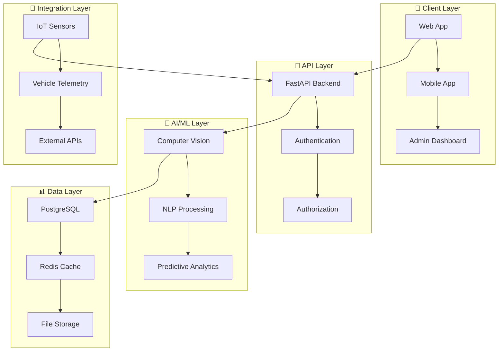

# 🛡️ **GUARDFLOW**
## **Sistema de Segurança e Mobilidade Inteligente**

[](https://www.python.org/)
[](https://fastapi.tiangolo.com/)
[](https://www.postgresql.org/)
[](https://www.docker.com/)
[](https://github.com/SH1W4/GuardFlow)
[](LICENSE)
[](https://github.com/SH1W4/GuardFlow/releases)

---

## 🎯 **VISÃO GERAL**

O **GuardFlow** é um sistema abrangente de segurança e mobilidade inteligente, projetado para proteger pessoas, veículos e infraestruturas através de tecnologias avançadas de monitoramento, análise e resposta em tempo real.

### **Características Principais:**
- 🛡️ **Sistema de Segurança** - Monitoramento 24/7 com IA
- 🚗 **Mobilidade Inteligente** - Telemetria e análise de veículos
- 📱 **Apps Multiplataforma** - iOS, Android e Web
- 🔗 **Integração Universal** - APIs para qualquer sistema
- 🤖 **IA/ML Avançado** - Análise preditiva e detecção de anomalias
- 🌐 **Cloud Native** - Escalabilidade e alta disponibilidade
- 📊 **Analytics** - Dashboards e relatórios em tempo real
- 🔒 **Segurança** - Criptografia end-to-end e compliance

---

## 🏗️ **ARQUITETURA**

### **GuardFlow System Architecture:**



---

## 🚀 **INSTALAÇÃO E CONFIGURAÇÃO**

### **Pré-requisitos:**
- Python 3.11+
- PostgreSQL 15+
- Redis 7+
- Docker (opcional)

### **Quick Start:**

1. **Clone o repositório**
   ```bash
   git clone https://github.com/SH1W4/GuardFlow.git
   cd GuardFlow
   ```

2. **Instalar dependências**
   ```bash
   pip install -r requirements.txt
   ```

3. **Configurar banco de dados**
   ```bash
   # PostgreSQL
   createdb guardflow
   ```

4. **Configurar variáveis de ambiente**
   ```bash
   cp .env.example .env
   # Editar .env com suas configurações
   ```

5. **Executar o servidor**
   ```bash
   uvicorn main:app --reload
   ```

6. **Testar endpoints**
   ```bash
   # Health check
   curl http://localhost:8000/health
   
   # API documentation
   http://localhost:8000/docs
   ```

---

## 🔌 **INTEGRAÇÃO**

### **Integração com Sistemas de Segurança:**

```python
# Exemplo de integração com sistema de segurança
from guardflow import GuardFlowClient

client = GuardFlowClient(api_key="your-api-key")

# Monitorar área
result = client.monitor_area({
    "area_id": "AREA-123",
    "sensors": ["camera", "motion", "audio"],
    "duration": 3600  # 1 hora
})
```

### **Integração com Telemetria de Veículos:**

```python
# Exemplo de integração com telemetria
result = client.process_telemetry({
    "vehicle_id": "VEH-123",
    "location": {"lat": -23.5505, "lng": -46.6333},
    "speed": 60.0,
    "fuel_level": 0.8,
    "timestamp": "2024-01-01T12:00:00Z"
})
```

### **Integração com IoT:**

```python
# Exemplo de integração com sensores IoT
result = client.process_sensor_data({
    "sensor_id": "SENSOR-456",
    "type": "temperature",
    "value": 25.5,
    "unit": "celsius",
    "location": "building-a-floor-1"
})
```

---

## 📊 **API ENDPOINTS**

### **Security Endpoints:**
- `GET /api/v1/security/status` - Status do sistema de segurança
- `POST /api/v1/security/alert` - Enviar alerta de segurança
- `GET /api/v1/security/events` - Listar eventos de segurança
- `POST /api/v1/security/response` - Responder a incidente

### **Mobility Endpoints:**
- `GET /api/v1/mobility/vehicles` - Listar veículos
- `POST /api/v1/mobility/telemetry` - Enviar dados de telemetria
- `GET /api/v1/mobility/routes` - Obter rotas otimizadas
- `POST /api/v1/mobility/maintenance` - Agendar manutenção

### **AI/ML Endpoints:**
- `POST /api/v1/ai/analyze` - Analisar dados com IA
- `GET /api/v1/ai/predictions` - Obter previsões
- `POST /api/v1/ai/anomaly` - Detectar anomalias
- `GET /api/v1/ai/insights` - Obter insights

### **Integration Endpoints:**
- `POST /api/v1/integration/webhook` - Webhook para integração
- `GET /api/v1/integration/status` - Status das integrações
- `POST /api/v1/integration/sync` - Sincronizar dados
- `GET /api/v1/integration/logs` - Logs de integração

---

## 🧪 **TESTING**

### **Testes Automatizados:**
```bash
# Executar todos os testes
pytest

# Testes com cobertura
pytest --cov=guardflow

# Testes de integração
pytest tests/integration/

# Testes de performance
pytest tests/performance/
```

### **Testes Manuais:**
```bash
# Health check
curl http://localhost:8000/health

# Security status
curl http://localhost:8000/api/v1/security/status

# Vehicle telemetry
curl -X POST http://localhost:8000/api/v1/mobility/telemetry \
  -H "Content-Type: application/json" \
  -d '{"vehicle_id": "VEH-123", "speed": 60, "location": {"lat": -23.5505, "lng": -46.6333}}'
```

---

## 🛣️ **ROADMAP**

### **Fase 1: Fundação (✅ Concluída)**
- [x] Backend FastAPI
- [x] Sistema de autenticação
- [x] APIs básicas de segurança
- [x] Integração com banco de dados
- [x] Documentação básica

### **Fase 2: Inteligência (🔄 Em Progresso)**
- [ ] IA/ML para detecção de anomalias
- [ ] Análise preditiva de segurança
- [ ] Otimização de rotas
- [ ] Dashboard avançado
- [ ] Mobile app completo

### **Fase 3: Expansão (📋 Planejado)**
- [ ] Integração com ERPs
- [ ] Compliance e auditoria
- [ ] Multi-tenant
- [ ] Global deployment
- [ ] Partnerships estratégicas

---

## 🔗 **PROJETOS INTEGRADOS**

- **[ecosystem-degov](https://github.com/SH1W4/ecosystem-degov)** - Backend Rust para ESG Token Ecosystem
- **[ecosystem-gst](https://github.com/SH1W4/ecosystem-gst)** - Smart contracts e tokens GST
- **[Selfbelt](https://github.com/SH1W4/selfbelt)** - Plataforma de telemetria
- **[Manus Framework](https://github.com/SH1W4/manus)** - Framework de desenvolvimento
- **[EON Framework](https://github.com/SH1W4/eon)** - Framework de integração

---

## 🤝 **CONTRIBUTING**

Agradecemos contribuições! Por favor, veja nosso [Guia de Contribuição](CONTRIBUTING.md) para detalhes.

1. Fork o repositório
2. Crie sua branch de feature (`git checkout -b feature/AmazingFeature`)
3. Commit suas mudanças (`git commit -m 'Add some AmazingFeature'`)
4. Push para a branch (`git push origin feature/AmazingFeature`)
5. Abra um Pull Request

### **Development Setup:**

```bash
# Instalar dependências
pip install -r requirements.txt

# Executar testes
pytest

# Executar linting
flake8

# Executar formatação
black .
```

---

## 📄 **LICENSE**

Este projeto está licenciado sob a Licença MIT - veja o arquivo [LICENSE](LICENSE) para detalhes.

---

## 👥 **TEAM**

- **SH1W4** - *Initial work* - [GitHub](https://github.com/SH1W4)

---

## 🙏 **ACKNOWLEDGMENTS**

- Comunidade Python e FastAPI
- Comunidade de segurança cibernética
- Frameworks de IA/ML
- Todos os contribuidores e testadores

---

## 📞 **SUPPORT**

- **Documentação**: [docs.guardflow.com](https://docs.guardflow.com)
- **Issues**: [GitHub Issues](https://github.com/SH1W4/GuardFlow/issues)
- **Email**: support@guardflow.com
- **Discord**: [GuardFlow Community](https://discord.gg/guardflow)

---

<div align="center">
Made with 🛡️ by SH1W4 | Protegendo o que mais importa!<br/>
Sistema de Segurança e Mobilidade Inteligente
</div>