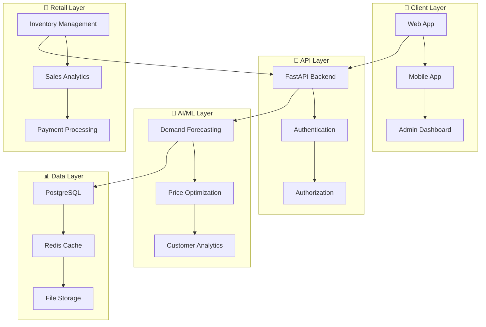

# 🛒 **GUARDFLOW**
## **Sistema Inteligente para Varejo**

[](https://www.python.org/)
[](https://fastapi.tiangolo.com/)
[](https://www.postgresql.org/)
[](https://www.docker.com/)
[](https://github.com/SH1W4/GuardFlow)
[](LICENSE)
[](https://github.com/SH1W4/GuardFlow/releases)

---

## 🎯 **VISÃO GERAL**

O **GuardFlow** é um sistema inteligente para varejo, projetado para otimizar operações comerciais, melhorar a experiência do cliente e aumentar a eficiência através de tecnologias avançadas de análise, automação e inteligência artificial.

### **Características Principais:**
- 🛒 **Gestão de Varejo** - Controle completo de estoque e vendas
- 📊 **Analytics Avançado** - Insights de vendas e comportamento do cliente
- 🤖 **IA/ML para Varejo** - Previsão de demanda e otimização de preços
- 📱 **Apps Multiplataforma** - iOS, Android e Web para varejistas
- 🔗 **Integração ERP** - Conecta com sistemas de gestão existentes
- 💳 **Pagamentos** - Soluções de pagamento integradas
- 🎯 **Marketing** - Campanhas personalizadas e CRM
- 📈 **Relatórios** - Dashboards e métricas de performance

---

## 🏗️ **ARQUITETURA**

### **GuardFlow Retail System Architecture:**



---

## 🚀 **INSTALAÇÃO E CONFIGURAÇÃO**

### **Pré-requisitos:**
- Python 3.11+
- PostgreSQL 15+
- Redis 7+
- Docker (opcional)

### **Quick Start:**

1. **Clone o repositório**
   ```bash
   git clone https://github.com/SH1W4/GuardFlow.git
   cd GuardFlow
   ```

2. **Instalar dependências**
   ```bash
   pip install -r requirements.txt
   ```

3. **Configurar banco de dados**
   ```bash
   # PostgreSQL
   createdb guardflow
   ```

4. **Configurar variáveis de ambiente**
   ```bash
   cp .env.example .env
   # Editar .env com suas configurações
   ```

5. **Executar o servidor**
   ```bash
   uvicorn main:app --reload
   ```

6. **Testar endpoints**
   ```bash
   # Health check
   curl http://localhost:8000/health
   
   # API documentation
   http://localhost:8000/docs
   ```

---

## 🔌 **INTEGRAÇÃO**

### **Integração com Sistemas de Varejo:**

```python
# Exemplo de integração com sistema de varejo
from guardflow import GuardFlowClient

client = GuardFlowClient(api_key="your-api-key")

# Gerenciar estoque
result = client.manage_inventory({
    "product_id": "PROD-123",
    "quantity": 100,
    "location": "warehouse-a",
    "action": "update"
})
```

### **Integração com Vendas:**

```python
# Exemplo de integração com vendas
result = client.process_sale({
    "sale_id": "SALE-456",
    "customer_id": "CUST-789",
    "products": [
        {"id": "PROD-123", "quantity": 2, "price": 29.99}
    ],
    "payment_method": "credit_card",
    "timestamp": "2024-01-01T12:00:00Z"
})
```

### **Integração com Analytics:**

```python
# Exemplo de integração com analytics
result = client.get_sales_analytics({
    "period": "last_30_days",
    "metrics": ["revenue", "units_sold", "top_products"],
    "filters": {"category": "electronics"}
})
```

---

## 📊 **API ENDPOINTS**

### **Retail Endpoints:**
- `GET /api/v1/retail/inventory` - Listar estoque
- `POST /api/v1/retail/sale` - Processar venda
- `GET /api/v1/retail/products` - Listar produtos
- `POST /api/v1/retail/order` - Criar pedido

### **Analytics Endpoints:**
- `GET /api/v1/analytics/sales` - Analytics de vendas
- `GET /api/v1/analytics/customers` - Analytics de clientes
- `GET /api/v1/analytics/inventory` - Analytics de estoque
- `POST /api/v1/analytics/report` - Gerar relatório

### **AI/ML Endpoints:**
- `POST /api/v1/ai/forecast` - Previsão de demanda
- `POST /api/v1/ai/optimize` - Otimização de preços
- `GET /api/v1/ai/recommendations` - Recomendações de produtos
- `POST /api/v1/ai/insights` - Obter insights de IA

### **Integration Endpoints:**
- `POST /api/v1/integration/webhook` - Webhook para integração
- `GET /api/v1/integration/status` - Status das integrações
- `POST /api/v1/integration/sync` - Sincronizar dados
- `GET /api/v1/integration/logs` - Logs de integração

---

## 🧪 **TESTING**

### **Testes Automatizados:**
```bash
# Executar todos os testes
pytest

# Testes com cobertura
pytest --cov=guardflow

# Testes de integração
pytest tests/integration/

# Testes de performance
pytest tests/performance/
```

### **Testes Manuais:**
```bash
# Health check
curl http://localhost:8000/health

# Security status
curl http://localhost:8000/api/v1/security/status

# Vehicle telemetry
curl -X POST http://localhost:8000/api/v1/mobility/telemetry \
  -H "Content-Type: application/json" \
  -d '{"vehicle_id": "VEH-123", "speed": 60, "location": {"lat": -23.5505, "lng": -46.6333}}'
```

---

## 🛣️ **ROADMAP**

### **Fase 1: Fundação (✅ Concluída)**
- [x] Backend FastAPI
- [x] Sistema de autenticação
- [x] APIs básicas de varejo
- [x] Integração com banco de dados
- [x] Documentação básica

### **Fase 2: Inteligência (🔄 Em Progresso)**
- [ ] IA/ML para previsão de demanda
- [ ] Análise preditiva de vendas
- [ ] Otimização de preços
- [ ] Dashboard avançado
- [ ] Mobile app completo

### **Fase 3: Expansão (📋 Planejado)**
- [ ] Integração com ERPs
- [ ] Multi-tenant
- [ ] Global deployment
- [ ] Partnerships estratégicas
- [ ] Marketplace de produtos

---

## 🔗 **PROJETOS INTEGRADOS**

- **[ecosystem-degov](https://github.com/SH1W4/ecosystem-degov)** - Backend Rust para ESG Token Ecosystem
- **[ecosystem-gst](https://github.com/SH1W4/ecosystem-gst)** - Smart contracts e tokens GST
- **[Selfbelt](https://github.com/SH1W4/selfbelt)** - Plataforma de telemetria
- **[Manus Framework](https://github.com/SH1W4/manus)** - Framework de desenvolvimento
- **[EON Framework](https://github.com/SH1W4/eon)** - Framework de integração

---

## 🤝 **CONTRIBUTING**

Agradecemos contribuições! Por favor, veja nosso [Guia de Contribuição](CONTRIBUTING.md) para detalhes.

1. Fork o repositório
2. Crie sua branch de feature (`git checkout -b feature/AmazingFeature`)
3. Commit suas mudanças (`git commit -m 'Add some AmazingFeature'`)
4. Push para a branch (`git push origin feature/AmazingFeature`)
5. Abra um Pull Request

### **Development Setup:**

```bash
# Instalar dependências
pip install -r requirements.txt

# Executar testes
pytest

# Executar linting
flake8

# Executar formatação
black .
```

---

## 📄 **LICENSE**

Este projeto está licenciado sob a Licença MIT - veja o arquivo [LICENSE](LICENSE) para detalhes.

---

## 👥 **TEAM**

- **SH1W4** - *Initial work* - [GitHub](https://github.com/SH1W4)

---

## 🙏 **ACKNOWLEDGMENTS**

- Comunidade Python e FastAPI
- Comunidade de segurança cibernética
- Frameworks de IA/ML
- Todos os contribuidores e testadores

---

## 📞 **SUPPORT**

- **Documentação**: [docs.guardflow.com](https://docs.guardflow.com)
- **Issues**: [GitHub Issues](https://github.com/SH1W4/GuardFlow/issues)
- **Email**: support@guardflow.com
- **Discord**: [GuardFlow Community](https://discord.gg/guardflow)

---

<div align="center">
Made with 🛒 by SH1W4 | Transformando o varejo com inteligência!<br/>
Sistema Inteligente para Varejo
</div>