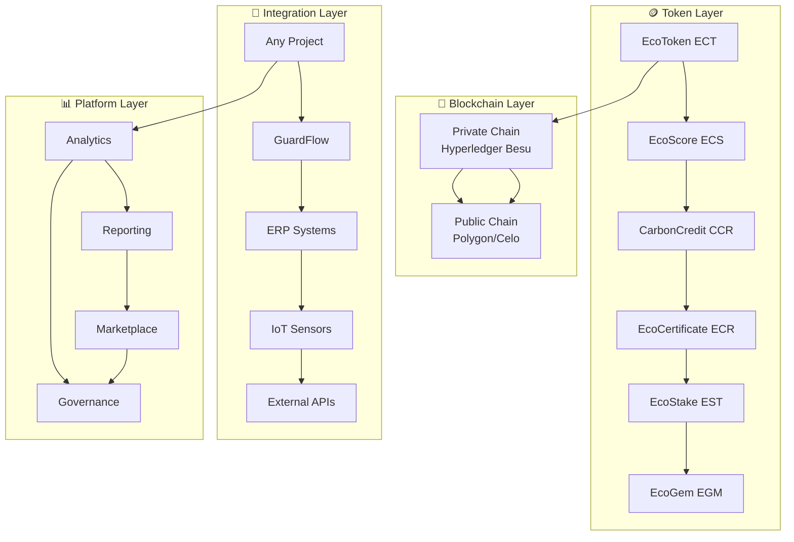

# 🌱 **ESG TOKEN ECOSYSTEM**
## **Plataforma Universal de Tokenização ESG**

[](https://www.rust-lang.org/)
[](https://github.com/tokio-rs/axum)
[](https://www.postgresql.org/)
[](https://ethereum.org/)
[](https://github.com/SH1W4/ecosystem-degov)

---

## 🎯 **VISÃO GERAL**

O **ESG Token Ecosystem** é uma plataforma universal e modular para tokenização de métricas ESG (Environmental, Social, and Governance), projetada para integração com qualquer projeto ou ecossistema que precise de tokenização de métricas sustentáveis.

### **Características Principais:**
- 🪙 **6 Tokens Interconectados** - EcoToken, EcoScore, CarbonCredit, EcoCertificate, EcoStake, EcoGem
- 🏗️ **Backend Rust** - Performance e segurança de nível empresarial
- 🔗 **Blockchain Híbrida** - Privada (Hyperledger Besu) + Pública (Polygon, Celo, XRPL)
- 🤖 **AI/ML Integrado** - Análise inteligente de dados ESG
- 🔗 **Integração Universal** - APIs padronizadas para qualquer projeto
- 🧾 **NFe to NFT** - Conversão de notas fiscais em NFTs únicos
- 🎮 **Gamificação** - Sistema de recompensas e missões
- ⚖️ **Governança** - Sistema de governança tokenizada
- 🌐 **Cross-Platform** - Sincronização entre diferentes plataformas

---

## 🏗️ **ARQUITETURA**

### **ESG Token Ecosystem Architecture:**



---

## 🪙 **TOKENS DO ECOSISTEMA**

### **1. EcoToken (ECT) - Token Principal**
- **Tipo**: ERC-20 (Fungível)
- **Blockchain**: Pública (Polygon, Celo)
- **Função**: Token principal para transações e recompensas
- **Supply**: 1 bilhão de tokens
- **Utilização**: Pagamentos, staking, governança

### **2. EcoScore (ECS) - Score de Sustentabilidade**
- **Tipo**: ERC-1155 (Semi-fungível)
- **Blockchain**: Privada (Hyperledger Besu)
- **Função**: Representa performance ESG do usuário
- **Supply**: Ilimitado (baseado em performance)
- **Utilização**: Desbloqueio de benefícios, gamificação

### **3. CarbonCredit (CCR) - Créditos de Carbono**
- **Tipo**: ERC-1155 (Semi-fungível)
- **Blockchain**: Privada (Hyperledger Besu)
- **Função**: Representa créditos de carbono verificados
- **Supply**: Baseado em reduções reais de CO₂
- **Utilização**: Compensação de emissões, trading

### **4. EcoCertificate (ECR) - Certificados ESG**
- **Tipo**: ERC-721 (Não-fungível)
- **Blockchain**: Pública (Polygon, Celo)
- **Função**: Certificados únicos de conquistas ESG
- **Supply**: Limitado por conquista
- **Utilização**: Prova de conquistas, colecionáveis

### **5. EcoStake (EST) - Staking e Governança**
- **Tipo**: ERC-20 (Fungível)
- **Blockchain**: Pública (Polygon, Celo)
- **Função**: Token para staking e governança
- **Supply**: 100 milhões de tokens
- **Utilização**: Staking, votação, recompensas

### **6. EcoGem (EGM) - Token Premium**
- **Tipo**: ERC-20 (Fungível)
- **Blockchain**: Pública (Polygon, Celo)
- **Função**: Token premium para benefícios exclusivos
- **Supply**: 10 milhões de tokens
- **Utilização**: Acesso VIP, recursos exclusivos

---

## 🚀 **INSTALAÇÃO E CONFIGURAÇÃO**

### **Pré-requisitos:**
- Rust 1.87.0+
- PostgreSQL 15+
- Node.js 18+ (para frontend)
- Docker (opcional)

### **Quick Start:**

1. **Clone o repositório**
   ```bash
   git clone https://github.com/SH1W4/ecosystem-degov.git
   cd ecosystem-degov/rust-backend
   ```

2. **Instalar dependências**
   ```bash
   cargo build
   ```

3. **Configurar banco de dados**
   ```bash
   # PostgreSQL
   createdb esg_token_ecosystem
   ```

4. **Configurar variáveis de ambiente**
   ```bash
   cp .env.example .env
   # Editar .env com suas configurações
   ```

5. **Executar o servidor**
   ```bash
   cargo run
   ```

6. **Testar endpoints**
   ```bash
   # Testar todos os endpoints
   .\test_ecotoken_ecosystem.bat
   
   # Testar integração GuardDrive
   .\test_guardrive_integration.bat
   
   # Testar endpoints GST
   .\test_gst_endpoints.bat
   ```

---

## 🔌 **INTEGRAÇÃO**

### **Integração com Projetos Existentes:**

```rust
// Exemplo de integração com qualquer projeto
use esg_token_ecosystem::EcoTokenService;

let eco_token = EcoTokenService::new().await?;

// Tokenizar métricas de qualquer sistema
let result = eco_token.tokenize_system_metrics(SystemMetrics {
    project_id: "PROJECT-123".to_string(),
    metric_type: "carbon_footprint".to_string(),
    value: 100.0, // kg CO2
    unit: "kg".to_string(),
    timestamp: chrono::Utc::now(),
}).await?;
```

### **Integração com Sistemas Corporativos:**

```rust
// Exemplo de integração com sistema corporativo
let result = eco_token.tokenize_corporate_metrics(CorporateMetrics {
    company_id: "COMP-456".to_string(),
    scope1_emissions: 1000.0, // tCO2
    scope2_emissions: 500.0,   // tCO2
    scope3_emissions: 2000.0,  // tCO2
    energy_consumption: 5000.0, // MWh
    renewable_energy: 0.3,      // 30%
}).await?;
```

### **Integração com GuardDrive (Exemplo):**

```rust
// Exemplo de integração com GuardDrive
let result = eco_token.tokenize_telemetry_data(TelemetryData {
    vehicle_id: "VEH-123".to_string(),
    distance: 100.0, // km
    fuel_efficiency: 15.0, // km/l
    emissions: 6.5, // kg CO2
    timestamp: chrono::Utc::now(),
}).await?;
```

---

## 📊 **API ENDPOINTS**

### **EcoToken (ECT) Endpoints:**
- `GET /api/v1/ect/balance/{user_id}` - Saldo do usuário
- `POST /api/v1/ect/transfer` - Transferir tokens
- `POST /api/v1/ect/mint` - Mintar novos tokens
- `POST /api/v1/ect/burn` - Queimar tokens

### **EcoScore (ECS) Endpoints:**
- `GET /api/v1/ecs/score/{user_id}` - Score do usuário
- `POST /api/v1/ecs/update` - Atualizar score
- `GET /api/v1/ecs/levels` - Níveis disponíveis
- `POST /api/v1/ecs/achievement` - Adicionar conquista

### **CarbonCredit (CCR) Endpoints:**
- `GET /api/v1/ccr/credits/{user_id}` - Créditos do usuário
- `POST /api/v1/ccr/purchase` - Comprar créditos
- `POST /api/v1/ccr/retire` - Aposentar créditos
- `GET /api/v1/ccr/marketplace` - Marketplace de créditos

### **EcoCertificate (ECR) Endpoints:**
- `GET /api/v1/ecr/certificates/{user_id}` - Certificados do usuário
- `POST /api/v1/ecr/mint` - Mintar certificado
- `GET /api/v1/ecr/verify/{certificate_id}` - Verificar certificado
- `GET /api/v1/ecr/types` - Tipos de certificado

### **EcoStake (EST) Endpoints:**
- `POST /api/v1/est/stake` - Fazer stake
- `POST /api/v1/est/unstake` - Remover stake
- `GET /api/v1/est/rewards/{user_id}` - Recompensas do usuário
- `GET /api/v1/est/tiers` - Níveis de staking

### **EcoGem (EGM) Endpoints:**
- `GET /api/v1/egm/balance/{user_id}` - Saldo EGM
- `POST /api/v1/egm/transfer` - Transferir EGM
- `GET /api/v1/egm/benefits` - Benefícios disponíveis
- `POST /api/v1/egm/access` - Acessar recurso premium

---

## 🧪 **TESTING**

### **Testes Automatizados:**
```bash
# Testar todos os endpoints
.\test_ecotoken_ecosystem.bat

# Testar integração GuardDrive
.\test_guardrive_integration.bat

# Testar endpoints GST
.\test_gst_endpoints.bat

# Testar backend completo
.\test_curl.bat
```

### **Testes Manuais:**
```bash
# Health check
curl http://localhost:3000/health

# ESG metrics
curl http://localhost:3000/api/v1/esg/metrics

# Token balance
curl http://localhost:3000/api/v1/ect/balance/user123
```

---

## 🛣️ **ROADMAP**

### **Fase 1: Fundação (✅ Concluída)**
- [x] Backend Rust com Axum
- [x] 6 tokens implementados
- [x] API REST completa
- [x] Integração GuardDrive
- [x] Sistema GST
- [x] NFe to NFT conversion
- [x] Gamificação básica
- [x] Governança tokenizada

### **Fase 2: Integração (🔄 Em Progresso)**
- [ ] Frontend React/TypeScript
- [ ] Mobile app React Native
- [ ] Integração com ERPs
- [ ] Smart contracts deployment
- [ ] Marketplace completo
- [ ] Analytics avançado

### **Fase 3: Expansão (📋 Planejado)**
- [ ] Multi-blockchain support
- [ ] AI/ML services
- [ ] Global partnerships
- [ ] Regulatory compliance
- [ ] Enterprise solutions
- [ ] Carbon markets integration

---

## 🔗 **PROJETOS INTEGRADOS**

- **[GuardFlow](https://github.com/SH1W4/GuardFlow)** - Sistema de mobilidade inteligente
- **[Selfbelt](https://github.com/SH1W4/selfbelt)** - Plataforma de telemetria
- **[Manus Framework](https://github.com/SH1W4/manus)** - Framework de desenvolvimento
- **[EON Framework](https://github.com/SH1W4/eon)** - Framework de integração

---

## 🤝 **CONTRIBUTING**

Agradecemos contribuições! Por favor, veja nosso [Guia de Contribuição](CONTRIBUTING.md) para detalhes.

1. Fork o repositório
2. Crie sua branch de feature (`git checkout -b feature/AmazingFeature`)
3. Commit suas mudanças (`git commit -m 'Add some AmazingFeature'`)
4. Push para a branch (`git push origin feature/AmazingFeature`)
5. Abra um Pull Request

### **Development Setup:**

```bash
# Instalar dependências
cargo build

# Executar testes
cargo test

# Executar linting
cargo clippy

# Executar formatação
cargo fmt
```

---

## 📄 **LICENSE**

Este projeto está licenciado sob a Licença MIT - veja o arquivo [LICENSE](LICENSE) para detalhes.

---

## 👥 **TEAM**

- **SH1W4** - *Initial work* - [GitHub](https://github.com/SH1W4)

---

## 🙏 **ACKNOWLEDGMENTS**

- Comunidade Rust e Axum
- Comunidade Ethereum e Solidity
- OpenZeppelin por contratos seguros
- Frameworks ESG (GRI, SASB, TCFD)
- Todos os contribuidores e testadores

---

## 📞 **SUPPORT**

- **Documentação**: [docs.esg-token.com](https://docs.esg-token.com)
- **Issues**: [GitHub Issues](https://github.com/SH1W4/ecosystem-degov/issues)
- **Email**: support@esg-token.com

---

<div align="center">
Made with 🌱 by SH1W4 | Transformando métricas ESG em valor digital!
</div>