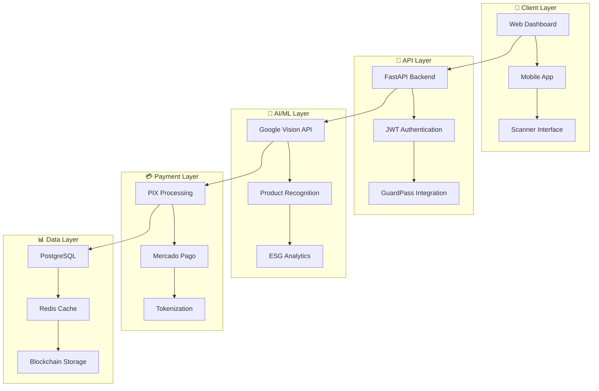

# 🛒 **GUARDFLOW**
## **Sistema de Checkout Inteligente para Varejo**

[](https://www.python.org/)
[](https://fastapi.tiangolo.com/)
[](https://reactjs.org/)
[](https://reactnative.dev/)
[](https://www.postgresql.org/)
[](https://www.docker.com/)
[](https://github.com/SH1W4/GuardFlow)
[](LICENSE)
[](https://github.com/SH1W4/GuardFlow/releases)

---

## 🎯 **VISÃO GERAL**

O **GuardFlow** é um sistema de checkout inteligente para varejo que transforma a experiência de compras através de scanner de produtos com IA, pagamentos PIX instantâneos, sistema ESG integrado e tokenização de transações. Projetado para "agilizar suas compras!" com tecnologia de ponta.

### **Características Principais:**
- 📱 **Scanner com IA** - Reconhecimento de produtos via Google Vision API
- 💳 **Pagamentos PIX** - Processamento instantâneo e seguro
- 🌱 **Sistema ESG** - Integração de métricas de sustentabilidade
- 🪙 **Tokenização** - Conversão de transações em tokens digitais
- 📊 **Analytics em Tempo Real** - Dashboards e insights avançados
- 🔐 **Segurança Enterprise** - Autenticação biométrica e JWT
- 🚀 **Multiplataforma** - Web, Mobile (iOS/Android) e API
- 🏪 **Integração GuardPass** - Sistema de monetização governamental

---

## 🏗️ **ARQUITETURA**

### **GuardFlow Checkout System Architecture:**



---

## 🚀 **INSTALAÇÃO E CONFIGURAÇÃO**

### **Pré-requisitos:**
- Python 3.11+
- Node.js 18+
- PostgreSQL 15+
- Redis 7+
- Docker (opcional)

### **Quick Start:**

1. **Clone o repositório**
   ```bash
   git clone https://github.com/SH1W4/GuardFlow.git
   cd GuardFlow
   ```

2. **Backend (FastAPI)**
   ```bash
   cd backend
   pip install -r requirements.txt
   uvicorn app.main:app --host 127.0.0.1 --port 8002 --reload
   ```

3. **Frontend (React)**
   ```bash
   cd guardflow-web
   npm install
   npm start
   ```

4. **Mobile (React Native)**
   ```bash
   cd mobile-app
   npm install
   npx react-native run-android
   # ou
   npx react-native run-ios
   ```

5. **Testar sistema**
   ```bash
   # Backend API
   curl http://localhost:8002/health
   
   # Frontend Web
   http://localhost:3000
   
   # API Documentation
   http://localhost:8002/docs
   ```

---

## 🔌 **INTEGRAÇÃO**

### **Integração com Scanner de Produtos:**

```python
# Exemplo de integração com scanner
from guardflow import GuardFlowClient

client = GuardFlowClient(api_key="your-api-key")

# Escanear produto
result = client.scan_product({
    "image": "base64_encoded_image",
    "store_id": "STORE-123",
    "user_id": "USER-456"
})
```

### **Integração com Pagamentos PIX:**

```python
# Exemplo de integração com PIX
result = client.create_pix_payment({
    "cart_id": "CART-789",
    "amount": 150.00,
    "customer_id": "CUST-123",
    "store_id": "STORE-456"
})
```

### **Integração com Sistema ESG:**

```python
# Exemplo de integração ESG
result = client.calculate_esg_score({
    "transaction_id": "TXN-123",
    "products": [
        {"id": "PROD-123", "esg_rating": 8.5}
    ],
    "store_id": "STORE-456"
})
```

---

## 📊 **API ENDPOINTS**

### **Scanner Endpoints:**
- `POST /api/v1/scanner/scan` - Escanear produto
- `GET /api/v1/scanner/products` - Listar produtos escaneados
- `POST /api/v1/scanner/populate-products` - Popular dados de teste

### **Payment Endpoints:**
- `POST /api/v1/payment/create-pix` - Criar pagamento PIX
- `GET /api/v1/payment/status/{id}` - Status do pagamento
- `POST /api/v1/payment/confirm/{id}` - Confirmar pagamento

### **Cart Endpoints:**
- `GET /api/v1/cart/` - Obter carrinho
- `POST /api/v1/cart/add` - Adicionar item ao carrinho
- `DELETE /api/v1/cart/remove` - Remover item do carrinho

### **ESG Endpoints:**
- `GET /api/v1/esg/dashboard` - Dashboard ESG
- `POST /api/v1/esg/calculate` - Calcular score ESG
- `GET /api/v1/esg/gamification` - Sistema de gamificação

### **Store Endpoints:**
- `GET /api/v1/stores/` - Listar lojas
- `GET /api/v1/stores/{id}/products` - Produtos da loja
- `POST /api/v1/stores/populate-stores` - Popular lojas de teste

---

## 🧪 **TESTING**

### **Testes Automatizados:**
```bash
# Executar todos os testes
pytest

# Testes com cobertura
pytest --cov=guardflow

# Testes de integração
pytest tests/integration/

# Testes de performance
pytest tests/performance/
```

### **Testes Manuais:**
```bash
# Health check
curl http://localhost:8000/health

# Security status
curl http://localhost:8000/api/v1/security/status

# Vehicle telemetry
curl -X POST http://localhost:8000/api/v1/mobility/telemetry \
  -H "Content-Type: application/json" \
  -d '{"vehicle_id": "VEH-123", "speed": 60, "location": {"lat": -23.5505, "lng": -46.6333}}'
```

---

## 🛣️ **ROADMAP**

### **Fase 1: MVP (✅ 85% Concluída)**
- [x] Backend FastAPI (90% funcional)
- [x] Mobile React Native (85% funcional)
- [x] Frontend React (70% funcional)
- [x] Sistema de autenticação JWT
- [x] Scanner com Google Vision API
- [x] Pagamentos PIX integrados
- [x] Sistema ESG implementado
- [x] Documentação completa

### **Fase 2: Finalização (🔄 Em Progresso)**
- [ ] Conectar mobile ao backend
- [ ] Completar frontend web
- [ ] Testes E2E completos
- [ ] Deploy em produção
- [ ] Demo funcional

### **Fase 3: Expansão (📋 Planejado)**
- [ ] 10 mercados ativos
- [ ] 1.000 usuários ativos
- [ ] Integração com ERPs
- [ ] Ecossistema GST completo
- [ ] IA avançada

---

## 🔗 **PROJETOS INTEGRADOS**

- **[ecosystem-degov](https://github.com/SH1W4/ecosystem-degov)** - Backend Rust para ESG Token Ecosystem
- **[ecosystem-gst](https://github.com/SH1W4/ecosystem-gst)** - Smart contracts e tokens GST
- **[Selfbelt](https://github.com/SH1W4/selfbelt)** - Plataforma de telemetria
- **[Manus Framework](https://github.com/SH1W4/manus)** - Framework de desenvolvimento
- **[EON Framework](https://github.com/SH1W4/eon)** - Framework de integração

---

## 🤝 **CONTRIBUTING**

Agradecemos contribuições! Por favor, veja nosso [Guia de Contribuição](CONTRIBUTING.md) para detalhes.

1. Fork o repositório
2. Crie sua branch de feature (`git checkout -b feature/AmazingFeature`)
3. Commit suas mudanças (`git commit -m 'Add some AmazingFeature'`)
4. Push para a branch (`git push origin feature/AmazingFeature`)
5. Abra um Pull Request

### **Development Setup:**

```bash
# Instalar dependências
pip install -r requirements.txt

# Executar testes
pytest

# Executar linting
flake8

# Executar formatação
black .
```

---

## 📄 **LICENSE**

Este projeto está licenciado sob a Licença MIT - veja o arquivo [LICENSE](LICENSE) para detalhes.

---

## 👥 **TEAM**

- **SH1W4** - *Initial work* - [GitHub](https://github.com/SH1W4)

---

## 🙏 **ACKNOWLEDGMENTS**

- Comunidade Python e FastAPI
- Comunidade de segurança cibernética
- Frameworks de IA/ML
- Todos os contribuidores e testadores

---

## 📞 **SUPPORT**

- **Documentação**: [docs.guardflow.com](https://docs.guardflow.com)
- **Issues**: [GitHub Issues](https://github.com/SH1W4/GuardFlow/issues)
- **Email**: support@guardflow.com
- **Discord**: [GuardFlow Community](https://discord.gg/guardflow)

---

<div align="center">
Made with 🛒 by SH1W4 | Agiliza aí suas compras!<br/>
Sistema de Checkout Inteligente para Varejo
</div>