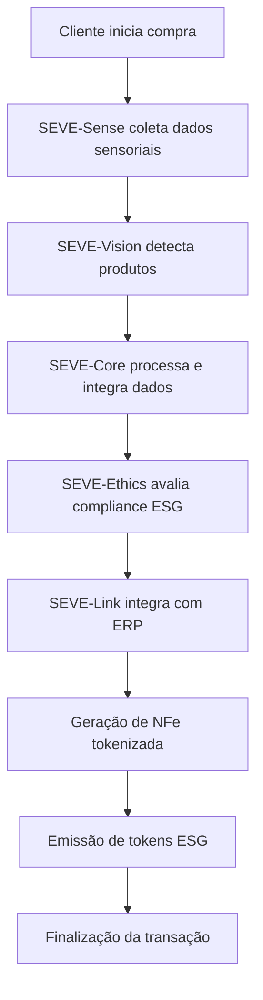
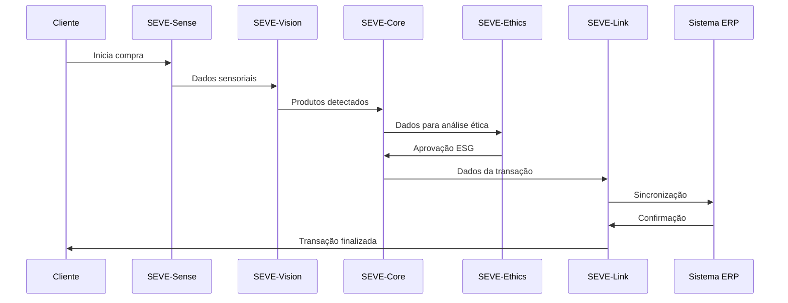

# SYMBEON FRAMEWORK - GUARDFLOW ADAPTATION

## 🎯 **VISÃO GERAL**

**SYMBEON-GUARDFLOW** é uma adaptação especializada do framework SYMBEON para o sistema de checkout inteligente GuardFlow, focada em detecção precisa de produtos, compliance ESG e integração ética com sistemas de varejo.

**Objetivo:** Sistema de IA ética e simbiótica para checkout inteligente que combina detecção precisa de produtos com compliance ESG e integração transparente com ERPs.

---

## 🏗️ **ARQUITETURA MODULAR**

### **🔧 SEVE-Core (Núcleo de Conhecimento)**

#### **Funcionalidades:**
- **Knowledge Graph de Produtos**: Base de dados semântica com produtos, categorias, códigos NCM e scores ESG
- **Motor de Inferência ESG**: Algoritmos para cálculo automático de scores ambientais, sociais e de governança
- **Integração de Dados**: Agregação de informações de múltiplas fontes (APIs externas, ERPs, sensores)
- **Aprendizado Contínuo**: Adaptação baseada em feedback de transações e padrões de compra

#### **Componentes Técnicos:**
```python
class SEVE_Core:
    def __init__(self):
        self.knowledge_graph = ProductKnowledgeGraph()
        self.esg_engine = ESGCalculationEngine()
        self.inference_engine = HybridInferenceEngine()
        self.learning_module = ContinuousLearningModule()
    
    def process_transaction(self, products, context):
        # Integra dados de produtos com contexto ESG
        esg_scores = self.esg_engine.calculate_scores(products)
        nfe_data = self.generate_nfe_data(products, esg_scores)
        return self.inference_engine.process(nfe_data, context)
```

---

### **🔧 SEVE-Vision (Detecção de Produtos)**

#### **Funcionalidades:**
- **Detecção Multi-Modal**: Combina scanner de código de barras, QR codes e reconhecimento visual
- **Classificação de Produtos**: Identificação precisa de produtos com base em características visuais
- **Validação de Peso**: Integração com sensores de peso para verificação de produtos
- **Detecção de Anomalias**: Identificação de produtos não reconhecidos ou suspeitos

#### **Componentes Técnicos:**
```python
class SEVE_Vision:
    def __init__(self):
        self.barcode_scanner = BarcodeScanner()
        self.qr_reader = QRCodeReader()
        self.visual_classifier = ProductVisualClassifier()
        self.weight_validator = WeightValidationSystem()
        self.anomaly_detector = AnomalyDetectionEngine()
    
    def detect_products(self, image_stream, weight_data):
        # Detecção multi-modal de produtos
        barcode_results = self.barcode_scanner.scan(image_stream)
        qr_results = self.qr_reader.read(image_stream)
        visual_results = self.visual_classifier.classify(image_stream)
        
        # Validação cruzada e detecção de anomalias
        validated_products = self.validate_detection(
            barcode_results, qr_results, visual_results, weight_data
        )
        return validated_products
```

---

### **🔧 SEVE-Ethics (Compliance ESG e LGPD)**

#### **Funcionalidades:**
- **Compliance ESG**: Verificação automática de conformidade com padrões ambientais, sociais e de governança
- **Proteção de Dados**: Implementação de princípios LGPD para dados de clientes e transações
- **Auditoria Ética**: Registro de todas as decisões para transparência e accountability
- **Bias Detection**: Detecção e correção de vieses em algoritmos de classificação

#### **Componentes Técnicos:**
```python
class SEVE_Ethics:
    def __init__(self):
        self.esg_compliance = ESGComplianceEngine()
        self.lgpd_protection = LGPDProtectionModule()
        self.audit_logger = EthicalAuditLogger()
        self.bias_detector = BiasDetectionSystem()
    
    def evaluate_transaction(self, products, customer_data, transaction_context):
        # Verificação de compliance ESG
        esg_compliance = self.esg_compliance.check(products)
        
        # Proteção de dados LGPD
        data_protection = self.lgpd_protection.protect(customer_data)
        
        # Detecção de vieses
        bias_analysis = self.bias_detector.analyze(products, customer_data)
        
        # Auditoria ética
        self.audit_logger.log_decision(esg_compliance, data_protection, bias_analysis)
        
        return self.generate_ethical_decision(esg_compliance, data_protection, bias_analysis)
```

---

### **🔧 SEVE-Link (Integração com Sistemas)**

#### **Funcionalidades:**
- **Integração ERP**: Conexão segura com sistemas ERP (SAP, Oracle, TOTVS)
- **API Gateway**: Interface unificada para comunicação com sistemas externos
- **Sincronização de Dados**: Sincronização em tempo real de inventário e preços
- **Webhook Management**: Gerenciamento de notificações e callbacks

#### **Componentes Técnicos:**
```python
class SEVE_Link:
    def __init__(self):
        self.erp_connector = ERPConnector()
        self.api_gateway = APIGateway()
        self.data_sync = DataSynchronizationEngine()
        self.webhook_manager = WebhookManager()
    
    def integrate_with_erp(self, transaction_data):
        # Sincronização com ERP
        erp_response = self.erp_connector.send_transaction(transaction_data)
        
        # Atualização de inventário
        inventory_update = self.data_sync.update_inventory(transaction_data)
        
        # Notificações via webhook
        self.webhook_manager.notify_stakeholders(transaction_data, erp_response)
        
        return erp_response, inventory_update
```

---

### **🔧 SEVE-Sense (Sensores e IoT)**

#### **Funcionalidades:**
- **Sensores de Peso**: Integração com balanças inteligentes para validação de produtos
- **Sensores de Movimento**: Detecção de gestos e interações do cliente
- **Sensores Ambientais**: Monitoramento de temperatura e umidade para produtos sensíveis
- **Sensores de Segurança**: Detecção de tentativas de fraude ou comportamento suspeito

#### **Componentes Técnicos:**
```python
class SEVE_Sense:
    def __init__(self):
        self.weight_sensors = WeightSensorArray()
        self.motion_sensors = MotionDetectionSystem()
        self.environmental_sensors = EnvironmentalMonitoring()
        self.security_sensors = SecurityDetectionSystem()
    
    def collect_sensor_data(self):
        # Coleta de dados multi-sensor
        weight_data = self.weight_sensors.get_current_weight()
        motion_data = self.motion_sensors.detect_movement()
        environmental_data = self.environmental_sensors.get_conditions()
        security_data = self.security_sensors.analyze_behavior()
        
        return self.fuse_sensor_data(weight_data, motion_data, environmental_data, security_data)
```

---

## 🔄 **FLUXO OPERACIONAL**

### **📱 Processo de Checkout Inteligente:**



### **🔧 Sequência de Processamento:**



---

## 💰 **MODELO DE NEGÓCIO SYMBEON-GUARDFLOW**

### **📊 Receita por Componente:**

#### **🔧 SEVE-Core (Knowledge Graph):**
- **Licença SaaS**: R$ 500/mês por mercado
- **Consultoria ESG**: R$ 2000/mês por mercado
- **Análise de Dados**: R$ 1000/mês por mercado
- **Total**: R$ 3500/mês por mercado

#### **🔧 SEVE-Vision (Detecção):**
- **Taxa por transação**: R$ 0,10 por produto
- **Licença de software**: R$ 300/mês por mercado
- **Suporte técnico**: R$ 500/mês por mercado
- **Total**: R$ 800/mês + R$ 0,10/transação

#### **🔧 SEVE-Ethics (Compliance):**
- **Auditoria ESG**: R$ 1000/mês por mercado
- **Compliance LGPD**: R$ 800/mês por mercado
- **Relatórios**: R$ 500/mês por mercado
- **Total**: R$ 2300/mês por mercado

#### **🔧 SEVE-Link (Integração):**
- **Integração ERP**: R$ 2000/mês por mercado
- **API Gateway**: R$ 500/mês por mercado
- **Sincronização**: R$ 300/mês por mercado
- **Total**: R$ 2800/mês por mercado

#### **🔧 SEVE-Sense (Sensores):**
- **Licença de sensores**: R$ 400/mês por mercado
- **Manutenção IoT**: R$ 300/mês por mercado
- **Monitoramento**: R$ 200/mês por mercado
- **Total**: R$ 900/mês por mercado

### **🎯 Receita Total por Mercado:**
- **SaaS Base**: R$ 10.300/mês
- **Taxa por Transação**: R$ 0,10 por produto
- **Volume Médio**: 1000 produtos/dia = R$ 3000/mês
- **Receita Total**: R$ 13.300/mês por mercado

---

## 🚀 **IMPLEMENTAÇÃO SYMBEON-GUARDFLOW**

### **📅 FASE 1: CORE + VISION (Semanas 1-8)**

#### **Objetivos:**
- Implementar SEVE-Core com knowledge graph de produtos
- Desenvolver SEVE-Vision para detecção precisa
- Integrar com APIs externas para validação
- Estabelecer baseline de performance

#### **Entregas:**
- Sistema SYMBEON básico funcionando
- Detecção de produtos com 95%+ precisão
- Knowledge graph com 1000+ produtos
- Integração com 2 mercados piloto

### **📅 FASE 2: ETHICS + LINK (Semanas 9-16)**

#### **Objetivos:**
- Implementar SEVE-Ethics para compliance ESG
- Desenvolver SEVE-Link para integração ERP
- Adicionar SEVE-Sense para sensores IoT
- Otimizar performance e custos

#### **Entregas:**
- Sistema SYMBEON completo
- Compliance ESG automático
- Integração ERP funcionando
- 10 mercados ativos

### **📅 FASE 3: OTIMIZAÇÃO + ESCALA (Semanas 17-24)**

#### **Objetivos:**
- Otimizar todos os módulos SYMBEON
- Escalar para 50 mercados
- Implementar aprendizado contínuo
- Maximizar receita e ROI

#### **Entregas:**
- Sistema SYMBEON otimizado
- 50 mercados ativos
- Aprendizado contínuo funcionando
- ROI de 1000%+

---

## 🎯 **VANTAGENS COMPETITIVAS**

### **✅ TÉCNICAS:**
- **Arquitetura modular** - Escalabilidade e manutenibilidade
- **IA ética** - Compliance automático ESG e LGPD
- **Knowledge graph** - Conhecimento semântico de produtos
- **Integração nativa** - Conectividade com ERPs

### **✅ NEGÓCIO:**
- **Diferenciação única** - Framework ético proprietário
- **Receita diversificada** - Múltiplas fontes de receita
- **Escalabilidade** - Crescimento ilimitado
- **Compliance** - Conformidade automática

### **✅ MERCADO:**
- **Adoção fácil** - Integração transparente
- **Custo-benefício** - ROI comprovado
- **Diferenciação** - Tecnologia única
- **Futuro** - Preparado para evolução

---

## 🎉 **CONCLUSÃO**

### **✅ SYMBEON-GUARDFLOW:**
- **Framework ético** - IA responsável e transparente
- **Arquitetura modular** - Escalável e manutenível
- **Compliance automático** - ESG e LGPD nativos
- **Integração nativa** - Conectividade com ERPs

### **🚀 BENEFÍCIOS:**
- **Para cliente** - Checkout ético e transparente
- **Para loja** - Compliance automático + Diferenciação
- **Para governo** - Transparência + Conformidade
- **Para planeta** - ESG nativo + Sustentabilidade

### **💰 PROJEÇÃO:**
- **Mês 1-6**: R$ 100K - R$ 500K
- **Mês 7-12**: R$ 500K - R$ 2M
- **Mês 13-24**: R$ 2M - R$ 10M
- **Ano 2+**: R$ 10M - R$ 50M

**SYMBEON-GUARDFLOW: Framework ético, inteligente e pronto para dominar o varejo brasileiro! 🛒⚡🌱🤖**

---

**Status**: ✅ ARQUITETURA COMPLETA
**Próxima Ação**: Implementar SEVE-Core e SEVE-Vision
**Responsável**: João (Product Owner)
**Data**: 2025-01-27
