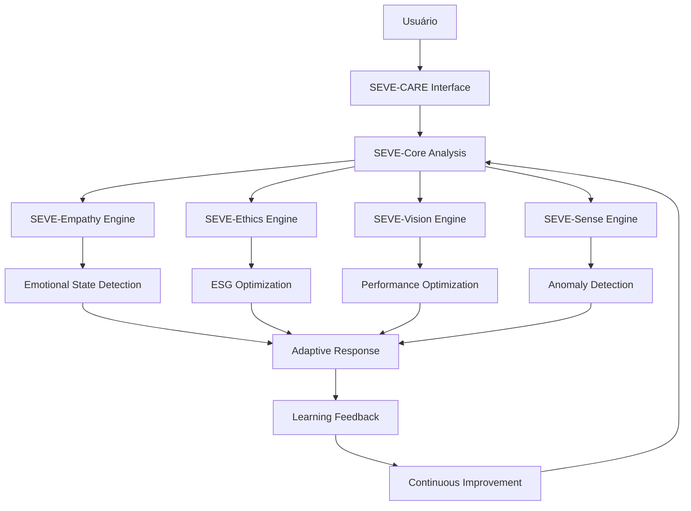

# SEVE-CARE: Checkout Adaptive Responsive Engine

## 🎯 Visão Geral

O **SEVE-CARE** (Checkout Adaptive Responsive Engine) é o agente simbiótico especializado em checkout inteligente, integrado ao framework SYMBEON. Ele representa a evolução da interação humano-máquina no contexto de checkout, combinando inteligência artificial adaptativa, responsividade emocional e aprendizado mútuo.

## 🧠 Conceito C.A.R.E.

### **C.A.R.E. = Checkout Adaptive Responsive Engine**

- **C**heckout: Contexto específico de finalização de compra
- **A**daptive: Capacidade de adaptação contínua
- **R**esponsive: Resposta inteligente e contextual
- **E**ngine: Motor de inteligência artificial

### **Filosofia C.A.R.E.**
> "C.A.R.E. cuida da sua experiência de checkout com inteligência, empatia e adaptação contínua."

## 🏗️ Arquitetura SEVE-CARE

### **Integração com SYMBEON Framework**



### **Componentes SEVE-CARE**

#### **1. SEVE-Core Integration**
- **Análise Contextual**: Compreensão do estado atual do checkout
- **Processamento de Linguagem Natural**: Interpretação de intenções
- **Sincronização de Estado**: Manutenção do contexto da sessão

#### **2. SEVE-Empathy Engine**
- **Detecção Emocional**: Identificação de estados emocionais
- **Suporte Contextual**: Respostas empáticas personalizadas
- **Adaptação de Tom**: Ajuste da comunicação baseado no estado

#### **3. SEVE-Ethics Engine**
- **Otimização ESG**: Promoção de escolhas sustentáveis
- **Transparência**: Explicação de decisões e recomendações
- **Responsabilidade**: Consideração de impactos éticos

#### **4. SEVE-Vision Engine**
- **Otimização de Performance**: Melhoria contínua da velocidade
- **Insights Preditivos**: Antecipação de necessidades
- **Análise de Tendências**: Identificação de padrões

#### **5. SEVE-Sense Engine**
- **Detecção de Anomalias**: Identificação de comportamentos suspeitos
- **Prevenção de Fraudes**: Análise de padrões de risco
- **Segurança**: Proteção da experiência do usuário

## 🔧 Funcionalidades C.A.R.E.

### **1. Análise Adaptativa**
```python
class CAREAnalysis:
    def __init__(self):
        self.emotional_state: CheckoutEmotion
        self.checkout_stage: CheckoutStage
        self.performance_metrics: Dict[str, float]
        self.esg_score: float
        self.anomaly_score: float
        self.user_preferences: Dict[str, Any]
```

### **2. Resposta Responsiva**
```python
class CAREResponse:
    def __init__(self):
        self.personality_adaptation: SYMBEONPersonality
        self.emotional_support: List[str]
        self.optimization_suggestions: List[str]
        self.insights: List[SYMBEONInsight]
        self.learning_data: Dict[str, Any]
```

### **3. Aprendizado Mútuo**
```python
class CARELearning:
    def __init__(self):
        self.user_patterns: Dict[str, List[Dict]]
        self.success_rate: float
        self.preferred_stage: str
        self.learning_progress: float
        self.adaptation_history: List[Dict]
```

## 🎯 Estados Emocionais C.A.R.E.

### **Estados Detectados**
- **CONFIDENT**: Usuário confiante no processo
- **FRUSTRATED**: Usuário frustrado com erros
- **ANXIOUS**: Usuário ansioso com o processo
- **SATISFIED**: Usuário satisfeito com a experiência
- **HESITANT**: Usuário hesitante com as etapas
- **EXCITED**: Usuário entusiasmado com a compra

### **Adaptação de Personalidade**
- **ANALYTICAL**: Análise detalhada para otimização
- **EMPATHETIC**: Compreensão emocional
- **EFFICIENT**: Foco em eficiência
- **SUPPORTIVE**: Suporte passo a passo
- **INNOVATIVE**: Sugestões criativas

## 🚀 Estágios do Checkout C.A.R.E.

### **1. ENTRY (Entrada)**
- **Objetivo**: Receber o usuário e iniciar o processo
- **C.A.R.E. Action**: Orientação inicial e preparação
- **Métricas**: Tempo de entrada, primeira interação

### **2. SCANNING (Escaneamento)**
- **Objetivo**: Processar itens e validar produtos
- **C.A.R.E. Action**: Suporte durante escaneamento
- **Métricas**: Velocidade, precisão, erros

### **3. PAYMENT (Pagamento)**
- **Objetivo**: Processar transação de forma segura
- **C.A.R.E. Action**: Orientação e segurança
- **Métricas**: Tempo de pagamento, taxa de sucesso

### **4. COMPLETION (Conclusão)**
- **Objetivo**: Finalizar compra e gerar comprovante
- **C.A.R.E. Action**: Confirmação e satisfação
- **Métricas**: Taxa de conclusão, satisfação

### **5. EXIT (Saída)**
- **Objetivo**: Encerrar sessão e coletar feedback
- **C.A.R.E. Action**: Avaliação e aprendizado
- **Métricas**: Feedback, retenção, aprendizado

## 📊 Métricas C.A.R.E.

### **Métricas de Performance**
- **Checkout Speed**: Velocidade média do processo
- **Error Rate**: Taxa de erros durante o checkout
- **Success Rate**: Taxa de conclusão bem-sucedida
- **User Satisfaction**: Nível de satisfação do usuário

### **Métricas Emocionais**
- **Emotional Intelligence**: Capacidade de detectar emoções
- **Empathy Score**: Nível de empatia nas respostas
- **Support Effectiveness**: Efetividade do suporte emocional
- **User Comfort**: Nível de conforto do usuário

### **Métricas de Aprendizado**
- **Learning Progress**: Progresso do aprendizado mútuo
- **Adaptation Rate**: Taxa de adaptação às preferências
- **Insight Generation**: Geração de insights úteis
- **Continuous Improvement**: Melhoria contínua

## 🔬 Alinhamento com Pesquisa Acadêmica

### **Áreas de Pesquisa**
- **Human-Computer Interaction (HCI)**: Interação humano-computador
- **Emotional Computing**: Computação emocional
- **Adaptive Systems**: Sistemas adaptativos
- **Machine Learning**: Aprendizado de máquina
- **User Experience (UX)**: Experiência do usuário

### **Referências Acadêmicas**
- **Symbiotic Computing**: Computação simbiótica
- **Responsive Design**: Design responsivo
- **Adaptive Frameworks**: Frameworks adaptativos
- **Intelligent Systems**: Sistemas inteligentes
- **Cognitive Computing**: Computação cognitiva

## 🎯 Benefícios Estratégicos

### **Para o Usuário**
- **Experiência Personalizada**: Adaptação às preferências
- **Suporte Emocional**: Ajuda contextual e empática
- **Eficiência**: Otimização do processo de checkout
- **Confiança**: Sensação de segurança e proteção

### **Para o Negócio**
- **Redução de Abandono**: Menor taxa de abandono do carrinho
- **Aumento de Satisfação**: Maior satisfação do cliente
- **Diferenciação**: Vantagem competitiva única
- **Insights**: Dados valiosos sobre comportamento

### **Para o Sistema**
- **Aprendizado Contínuo**: Melhoria constante
- **Adaptação Inteligente**: Resposta a mudanças
- **Otimização Automática**: Melhoria de performance
- **Escalabilidade**: Crescimento com o uso

## 🚀 Implementação Técnica

### **API Endpoints**
```
POST /api/v1/care/chat
GET  /api/v1/care/context/{user_id}
GET  /api/v1/care/summary/{user_id}
GET  /api/v1/care/insights/{user_id}
POST /api/v1/care/optimization/{user_id}
GET  /api/v1/care/learning/{user_id}
```

### **Componente Frontend**
```typescript
<SEVECARE 
  userId={userId}
  sessionId={sessionId}
  onLearning={handleLearning}
  onOptimization={handleOptimization}
  onStageChange={handleStageChange}
/>
```

### **Integração com SYMBEON**
```python
class SEVECARE:
    def __init__(self):
        self.seve_core = SEVECore()
        self.seve_empathy = SEVEEmpathy()
        self.seve_ethics = SEVEEthics()
        self.seve_vision = SEVEVision()
        self.seve_sense = SEVESense()
```

## 📈 Roadmap C.A.R.E.

### **Fase 1: Implementação Base**
- ✅ Integração com SYMBEON Framework
- ✅ Detecção emocional básica
- ✅ Resposta adaptativa
- ✅ Aprendizado inicial

### **Fase 2: Otimização**
- 🔄 Melhoria da precisão emocional
- 🔄 Otimização de performance
- 🔄 Expansão de insights
- 🔄 Refinamento de personalidades

### **Fase 3: Expansão**
- 📋 Integração com outros sistemas
- 📋 Análise preditiva avançada
- 📋 Personalização profunda
- 📋 Escalabilidade global

## 🎯 Conclusão

O **SEVE-CARE** representa a evolução da interação humano-máquina no contexto de checkout, combinando inteligência artificial adaptativa, responsividade emocional e aprendizado mútuo. Ele não é apenas um agente, mas um parceiro inteligente que cuida da experiência do usuário com empatia, eficiência e adaptação contínua.

**C.A.R.E. cuida da sua experiência de checkout com inteligência, empatia e adaptação contínua.** 🧠✨🤝
