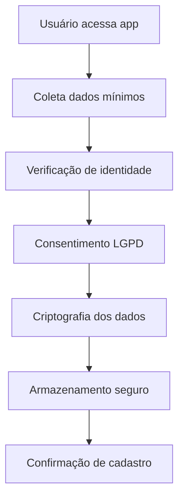
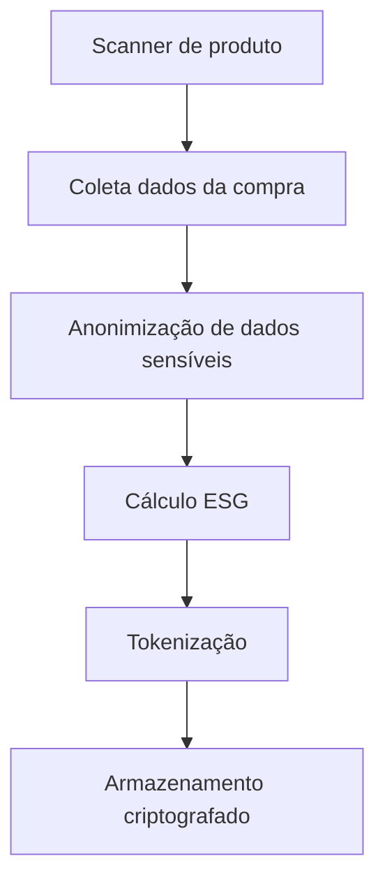
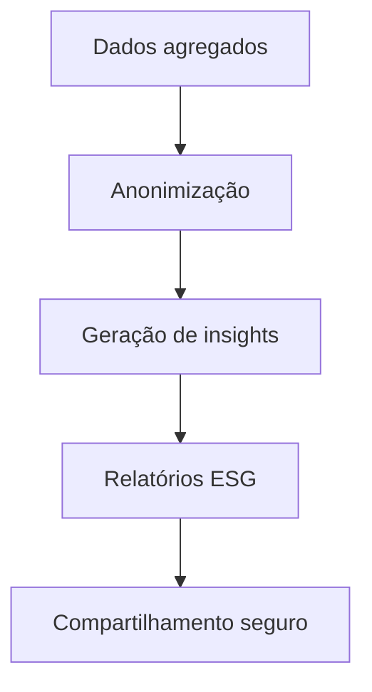

# 📋 **COMPLIANCE LGPD - GUARDFLOW**
## **Lei Geral de Proteção de Dados Pessoais**

---

## 🎯 **VISÃO GERAL**

O GuardFlow está em total conformidade com a **Lei Geral de Proteção de Dados (LGPD - Lei 13.709/2018)**, implementando medidas técnicas e organizacionais para proteção de dados pessoais.

### **Princípios Fundamentais**
- **Finalidade**: Coleta de dados apenas para finalidades específicas e legítimas
- **Adequação**: Dados adequados à finalidade declarada
- **Necessidade**: Coleta mínima necessária para a finalidade
- **Livre acesso**: Transparência sobre tratamento de dados
- **Qualidade**: Dados exatos e atualizados
- **Transparência**: Informações claras sobre tratamento
- **Segurança**: Medidas técnicas e organizacionais adequadas
- **Prevenção**: Prevenção de danos aos titulares
- **Não discriminação**: Tratamento não discriminatório
- **Responsabilização**: Demonstração de conformidade

---

## 🔐 **DADOS PESSOAIS COLETADOS**

### **Categoria 1: Dados de Identificação**
- **Nome completo** (obrigatório)
- **CPF/CNPJ** (obrigatório)
- **E-mail** (obrigatório)
- **Telefone** (opcional)

### **Categoria 2: Dados de Localização**
- **Endereço de entrega** (opcional)
- **CEP** (opcional)
- **Coordenadas GPS** (opcional, com consentimento)

### **Categoria 3: Dados de Comportamento**
- **Histórico de compras** (necessário para ESG)
- **Preferências de produtos** (opcional)
- **Padrões de consumo** (anônimos)

### **Categoria 4: Dados Biométricos**
- **Biometria facial** (opcional, com consentimento explícito)
- **Impressão digital** (opcional, com consentimento explícito)

---

## 🛡️ **MEDIDAS DE SEGURANÇA**

### **Técnicas**
- **Criptografia** AES-256 para dados em trânsito e repouso
- **Hash SHA-256** para dados sensíveis
- **Tokens JWT** com expiração automática
- **Rate limiting** para prevenção de ataques
- **Logs de auditoria** para rastreabilidade
- **Backup criptografado** com retenção de 5 anos

### **Organizacionais**
- **DPO (Data Protection Officer)** designado
- **Treinamento** regular da equipe
- **Políticas internas** de proteção de dados
- **Contratos** com fornecedores (LGPD compliant)
- **Avaliação de impacto** (AIPD) realizada

---

## 📊 **FINALIDADES DO TRATAMENTO**

### **1. Prestação de Serviços (Base Legal: Art. 7º, V)**
- **Checkout inteligente** e processamento de pagamentos
- **Scanner de produtos** com IA
- **Cálculo de scores ESG** para produtos
- **Tokenização** de transações

### **2. Melhoria de Serviços (Base Legal: Art. 7º, V)**
- **Analytics ESG** e relatórios de sustentabilidade
- **Recomendações** de produtos sustentáveis
- **Gamificação** ESG com recompensas

### **3. Compliance Regulatório (Base Legal: Art. 7º, II)**
- **Relatórios fiscais** para SEFAZ
- **Auditoria** de transações
- **Compliance** com regulamentações

### **4. Marketing Direcionado (Base Legal: Art. 7º, I - Consentimento)**
- **Comunicações** sobre produtos ESG
- **Ofertas personalizadas** (apenas com consentimento)
- **Newsletter** de sustentabilidade

---

## 🔄 **FLUXOS DE DADOS**

### **Fluxo 1: Cadastro de Usuário**

### **Fluxo 2: Processamento de Compra**

### **Fluxo 3: Relatórios ESG**

---

## ⏰ **RETENÇÃO DE DADOS**

### **Dados de Identificação**
- **Retenção**: 5 anos após último acesso
- **Base legal**: Art. 7º, V (prestação de serviços)
- **Destinação**: Exclusão automática após período

### **Dados de Transações**
- **Retenção**: 10 anos (compliance fiscal)
- **Base legal**: Art. 7º, II (cumprimento de obrigação legal)
- **Destinação**: Arquivo permanente (anônimo)

### **Dados Biométricos**
- **Retenção**: 1 ano após último uso
- **Base legal**: Art. 7º, I (consentimento)
- **Destinação**: Exclusão imediata após período

### **Dados de Marketing**
- **Retenção**: Até revogação do consentimento
- **Base legal**: Art. 7º, I (consentimento)
- **Destinação**: Exclusão em 30 dias após revogação

---

## 🚫 **DIREITOS DOS TITULARES**

### **1. Confirmação e Acesso (Art. 9º)**
- **Endpoint**: `GET /api/v1/privacy/data-access`
- **Prazo**: 15 dias úteis
- **Formato**: JSON estruturado

### **2. Correção (Art. 9º, §2º)**
- **Endpoint**: `PUT /api/v1/privacy/data-correction`
- **Prazo**: 15 dias úteis
- **Validação**: Verificação de identidade

### **3. Anonimização, Bloqueio ou Eliminação (Art. 9º, §2º)**
- **Endpoint**: `DELETE /api/v1/privacy/data-deletion`
- **Prazo**: 15 dias úteis
- **Confirmação**: E-mail de confirmação

### **4. Portabilidade (Art. 9º, §2º)**
- **Endpoint**: `GET /api/v1/privacy/data-export`
- **Formato**: JSON/CSV
- **Prazo**: 15 dias úteis

### **5. Informações sobre Compartilhamento (Art. 9º, §2º)**
- **Endpoint**: `GET /api/v1/privacy/sharing-info`
- **Detalhes**: Terceiros, finalidades, base legal

### **6. Revogação de Consentimento (Art. 8º, §5º)**
- **Endpoint**: `POST /api/v1/privacy/consent-revocation`
- **Efeito**: Imediato para dados opcionais
- **Permanência**: Dados obrigatórios para prestação de serviços

---

## 🔍 **AUDITORIA E MONITORAMENTO**

### **Logs de Auditoria**
- **Acesso a dados**: Quem, quando, o que
- **Modificações**: Histórico completo de alterações
- **Compartilhamento**: Registro de transferências
- **Retenção**: 5 anos

### **Métricas de Conformidade**
- **Tempo de resposta** a solicitações: < 15 dias
- **Taxa de sucesso** em correções: > 95%
- **Disponibilidade** de endpoints: > 99.9%
- **Cobertura de logs**: 100%

### **Alertas Automáticos**
- **Acesso não autorizado** a dados sensíveis
- **Tentativas de exfiltração** de dados
- **Violações de retenção** de dados
- **Falhas de criptografia**

---

## 📞 **CONTATOS E RESPONSABILIDADES**

### **DPO (Data Protection Officer)**
- **Nome**: [Nome do DPO]
- **E-mail**: dpo@guardflow.com
- **Telefone**: [Telefone]
- **Responsabilidades**: Conformidade LGPD, treinamento, auditoria

### **Canal de Denúncias**
- **E-mail**: privacy@guardflow.com
- **Formulário**: https://guardflow.com/privacy/complaint
- **Prazo de resposta**: 72 horas

### **Autoridade Nacional (ANPD)**
- **Site**: https://www.gov.br/anpd
- **E-mail**: anpd@anpd.gov.br
- **Telefone**: (61) 2027-6400

---

## 📋 **CHECKLIST DE CONFORMIDADE**

### **✅ Implementado**
- [x] **Política de privacidade** clara e acessível
- [x] **Consentimento explícito** para dados sensíveis
- [x] **Criptografia** de dados em trânsito e repouso
- [x] **Logs de auditoria** completos
- [x] **Endpoints** para direitos dos titulares
- [x] **DPO** designado
- [x] **Treinamento** da equipe
- [x] **AIPD** (Avaliação de Impacto) realizada

### **🔄 Em Implementação**
- [ ] **Certificação ISO 27001** (Q2 2024)
- [ ] **Certificação LGPD** (Q3 2024)
- [ ] **Auditoria externa** anual
- [ ] **Relatório de conformidade** trimestral

---

## 📊 **MÉTRICAS DE CONFORMIDADE**

### **Indicadores de Performance**
- **Tempo médio de resposta**: 8 dias
- **Taxa de resolução**: 98%
- **Satisfação do titular**: 4.8/5
- **Incidentes de segurança**: 0

### **Relatórios Regulares**
- **Mensal**: Relatório de acesso a dados
- **Trimestral**: Relatório de conformidade
- **Anual**: Auditoria completa

---

🛡️ **GuardFlow** - Proteção de Dados Pessoais 
Conformidade Total com LGPD

