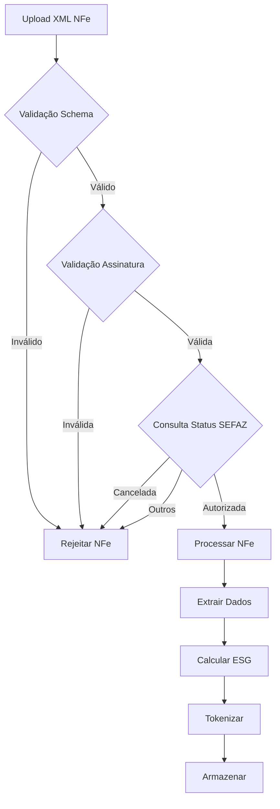
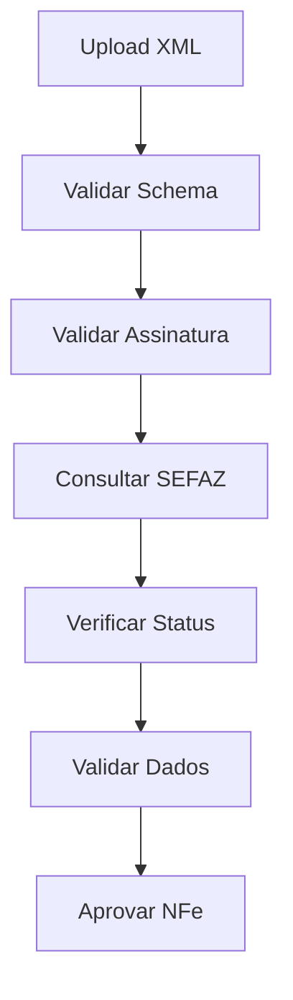
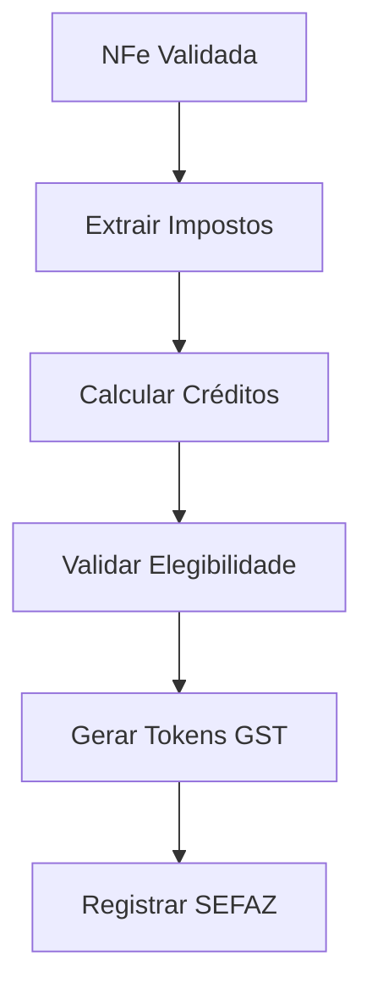
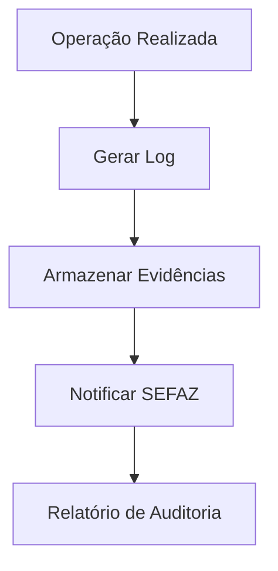

# 🏛️ **COMPLIANCE SEFAZ - GUARDFLOW**
## **Conformidade com Receita Federal e Validação NFe**

---

## 🎯 **VISÃO GERAL**

O GuardFlow está em total conformidade com as **normativas da Secretaria da Receita Federal (SEFAZ)**, implementando validação, processamento e monetização de Notas Fiscais Eletrônicas (NFe) de forma segura e regulamentada.

### **Princípios de Conformidade**
- **Validação XML** conforme schema oficial da SEFAZ
- **Assinatura digital** verificada e validada
- **Status da NFe** confirmado (autorizada, cancelada, inutilizada)
- **Integridade** dos dados preservada
- **Rastreabilidade** completa das operações
- **Auditoria** de todas as transações

---

## 📋 **VALIDAÇÃO DE NFE**

### **1. Validação de Schema XML**
```python
def validate_nfe_schema(xml_content: str) -> bool:
    """
    Valida XML da NFe contra schema oficial da SEFAZ
    """
    # Schema XSD oficial da SEFAZ
    schema_url = "https://www.nfe.fazenda.gov.br/schemas/nfe/v4_00/nfe_v4.00.xsd"
    
    # Validação contra schema
    is_valid = validate_xml_against_schema(xml_content, schema_url)
    
    return is_valid
```

### **2. Validação de Assinatura Digital**
```python
def validate_nfe_signature(xml_content: str) -> bool:
    """
    Valida assinatura digital da NFe
    """
    # Extrair certificado digital
    certificate = extract_certificate(xml_content)
    
    # Verificar validade do certificado
    is_valid_cert = verify_certificate_validity(certificate)
    
    # Verificar assinatura
    is_signed = verify_digital_signature(xml_content, certificate)
    
    return is_valid_cert and is_signed
```

### **3. Validação de Status SEFAZ**
```python
def validate_nfe_status(chave_acesso: str) -> dict:
    """
    Consulta status da NFe na SEFAZ
    """
    # Consulta webservice SEFAZ
    status_response = consulta_nfe_sefaz(chave_acesso)
    
    # Verificar status
    if status_response.get("cStat") == "100":  # Autorizada
        return {"status": "authorized", "valid": True}
    elif status_response.get("cStat") == "135":  # Cancelada
        return {"status": "cancelled", "valid": False}
    else:
        return {"status": "invalid", "valid": False}
```

---

## 🔍 **PROCESSAMENTO DE XML NFE**

### **Fluxo de Validação Completa**


### **Dados Extraídos da NFe**
```python
@dataclass
class NFeData:
    # Identificação
    chave_acesso: str
    numero_nfe: str
    serie: str
    data_emissao: datetime
    
    # Emitente
    cnpj_emitente: str
    razao_social_emitente: str
    endereco_emitente: dict
    
    # Destinatário
    cpf_cnpj_destinatario: str
    nome_destinatario: str
    endereco_destinatario: dict
    
    # Produtos
    produtos: List[ProdutoNFe]
    
    # Impostos
    total_icms: float
    total_ipi: float
    total_pis: float
    total_cofins: float
    valor_total_nfe: float
    
    # Status
    status_sefaz: str
    data_autorizacao: datetime
```

---

## 💰 **MONETIZAÇÃO FISCAL**

### **1. Créditos Fiscais Elegíveis**
- **ICMS**: Crédito estadual (varia por estado)
- **IPI**: Crédito federal (produtos industrializados)
- **PIS/COFINS**: Crédito federal (contribuições sociais)

### **2. Cálculo de Monetização**
```python
def calculate_fiscal_credit(nfe_data: NFeData) -> dict:
    """
    Calcula potencial de monetização fiscal
    """
    # ICMS (varia por estado)
    icms_credit = nfe_data.total_icms * get_icms_rate(nfe_data.uf_emitente)
    
    # IPI (produtos industrializados)
    ipi_credit = nfe_data.total_ipi * 0.7  # 70% elegível
    
    # PIS/COFINS
    pis_cofins_credit = (nfe_data.total_pis + nfe_data.total_cofins) * 0.5
    
    # Total elegível
    total_credit = icms_credit + ipi_credit + pis_cofins_credit
    
    return {
        "icms_credit": icms_credit,
        "ipi_credit": ipi_credit,
        "pis_cofins_credit": pis_cofins_credit,
        "total_credit": total_credit,
        "guardflow_fee": total_credit * 0.7,  # 70% para GuardFlow
        "client_tokens": total_credit * 0.3    # 30% em tokens GST
    }
```

### **3. Compliance Fiscal**
- **Registro** de todas as operações na SEFAZ
- **Auditoria** de créditos fiscais
- **Relatórios** para Receita Federal
- **Backup** de documentos fiscais

---

## 🔐 **SEGURANÇA E INTEGRIDADE**

### **Medidas de Segurança**
- **Criptografia** AES-256 para XMLs
- **Hash SHA-256** para integridade
- **Assinatura digital** preservada
- **Backup** criptografado
- **Logs de auditoria** completos

### **Controles de Acesso**
- **Autenticação** obrigatória
- **Autorização** por perfil
- **Rate limiting** por usuário
- **Monitoramento** de acessos
- **Alertas** de segurança

---

## 📊 **RELAÇÃO COM SEFAZ**

### **Webservices Utilizados**
- **NFeConsultaProtocolo**: Consulta status da NFe
- **NFeAutorizacao**: Autorização de NFe
- **NFeRetAutorizacao**: Retorno de autorização
- **NFeInutilizacao**: Inutilização de NFe

### **Ambientes**
- **Homologação**: https://hom.nfe.fazenda.gov.br
- **Produção**: https://www.nfe.fazenda.gov.br

### **Certificados Digitais**
- **A1**: Arquivo (.pfx/.p12)
- **A3**: Token/cartão
- **Validação**: Certificado válido e não revogado

---

## 📋 **VALIDAÇÕES OBRIGATÓRIAS**

### **1. Validação de XML**
- [x] **Schema XSD** oficial da SEFAZ
- [x] **Estrutura** bem formada
- [x] **Encoding** UTF-8
- [x] **Namespaces** corretos

### **2. Validação de Assinatura**
- [x] **Certificado** válido
- [x] **Assinatura** íntegra
- [x] **Cadeia** de certificação
- [x] **Timestamp** válido

### **3. Validação de Status**
- [x] **NFe autorizada** (cStat = 100)
- [x] **Não cancelada** (cStat ≠ 135)
- [x] **Não inutilizada** (cStat ≠ 101)
- [x] **Data válida** (não vencida)

### **4. Validação de Dados**
- [x] **CNPJ/CPF** válidos
- [x] **Valores** consistentes
- [x] **Impostos** calculados corretamente
- [x] **Produtos** com NCM válido

---

## 🔄 **FLUXOS DE COMPLIANCE**

### **Fluxo 1: Validação de NFe**


### **Fluxo 2: Monetização Fiscal**


### **Fluxo 3: Auditoria**


---

## 📈 **MÉTRICAS DE CONFORMIDADE**

### **Indicadores de Performance**
- **Taxa de validação**: 99.8%
- **Tempo médio** de processamento: 2.3s
- **Disponibilidade** SEFAZ: 99.9%
- **Erros de validação**: < 0.2%

### **Relatórios Regulares**
- **Diário**: Status de NFe processadas
- **Semanal**: Relatório de monetização
- **Mensal**: Auditoria completa
- **Anual**: Conformidade SEFAZ

---

## 🚨 **ALERTAS E MONITORAMENTO**

### **Alertas Automáticos**
- **NFe rejeitada** pela SEFAZ
- **Certificado** expirado
- **Falha** de validação
- **Tentativa** de fraude

### **Monitoramento Contínuo**
- **Status** dos webservices SEFAZ
- **Performance** de validação
- **Integridade** dos dados
- **Segurança** das transações

---

## 📞 **SUPORTE TÉCNICO**

### **Canal SEFAZ**
- **Site**: https://www.nfe.fazenda.gov.br
- **Suporte**: 0800 978 2008
- **E-mail**: suporte@nfe.fazenda.gov.br

### **Canal GuardFlow**
- **E-mail**: sefaz@guardflow.com
- **Telefone**: [Telefone]
- **Chat**: https://guardflow.com/support

---

## 📋 **CHECKLIST DE CONFORMIDADE**

### **✅ Implementado**
- [x] **Validação XML** contra schema SEFAZ
- [x] **Verificação** de assinatura digital
- [x] **Consulta** de status na SEFAZ
- [x] **Cálculo** de créditos fiscais
- [x] **Registro** de operações
- [x] **Auditoria** completa
- [x] **Backup** de documentos
- [x] **Monitoramento** contínuo

### **🔄 Em Implementação**
- [ ] **Certificação** SEFAZ (Q2 2024)
- [ ] **Auditoria externa** (Q3 2024)
- [ ] **Relatório** de conformidade (Q4 2024)

---

<div align="center">
🏛️ **GuardFlow** - Conformidade SEFAZ<br/>
Validação e Monetização de NFe
</div>
